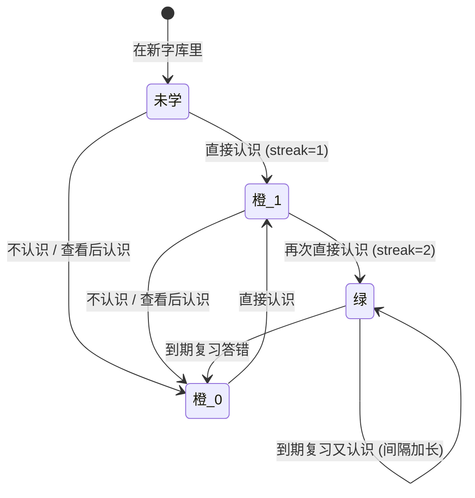

# 识字 — 设计文档

一个帮成年人把汉字认全的 web app。目标是从「认得一些字」走到「能顺畅读书报」。

- 状态：v0.1 实现中
- 最后更新：2026-07-30
- 交互原型：[`mock/index.html`](mock/index.html)（可直接双击打开）

---

## 1. 目标与非目标

### 要做到的

- 覆盖现代书报用字，即《通用规范汉字表》一级字表 **3500 字**
- 出字顺序按**实际使用频率**从高到低，先学的字回报最大
- 用户能清楚看到「我会多少字了」，并且这个数字**一直在涨**
- 学过的字不会学完就忘 —— 靠反复出现巩固，不是学一次就再也不管
- 装在手机上，没网也能用，碎片时间随手学几个

### 明确不做的

- **不教写字**。不做笔顺、不做描红。目标是「认」，不是「写」。
- **不做发音评测**。曾经考虑过录音判读，最后定为自评（见 §4.1）。
- **不做账号系统**。数据在本地，跨设备靠导出/导入文件。
- **不教语法、不做课程**。这是字库工具，不是教材。

### 目标用户

成年人，已经认得一些常用字，不是零基础。可能是：想恢复中文阅读的华裔、学到瓶颈期的中文学习者、想系统补齐的成年人。

关键含义：**不需要新手引导，不需要从「一」开始教起**。用户会大量地在前几百字上按「认识」快速刷过去 —— 这本身就是定级过程，所以不单做定级测试。

---

## 2. 字库数据

### 2.1 来源

| 环节 | 用什么 | 为什么 |
|---|---|---|
| 字集 | 《通用规范汉字表》(2013) 一级字表 3500 字 | 官方规范，覆盖现代书报约 99.5% 用字 |
| 排序 | wordfreq 中文词频 | 多语料合并，比单一语料稳 |
| 组词 | wordfreq 词频前 2，CC-CEDICT 把关 | 频率决定「常见」，词典决定「是不是真词」 |
| 注音 | pypinyin + 变调 mixin | 词内多音字靠上下文判定 |

生成脚本：[`data/build_chars.py`](data/build_chars.py)，可随时重跑。原始数据在 `data/raw/`。

### 2.2 字频怎么算

**不能直接用单字词频。** 「馆」几乎不单独成词，单字频率极低，但「宾馆/图书馆/体育馆」都很常见 —— 按单字频率排会把它扔到很后面，这是错的。

正确做法是把**词频摊到字上**再累加：

```
charFreq[c] = Σ  wordFreq[w] × (c 在 w 中出现的次数)
             w ∋ c
```

这样「馆」能靠它参与的所有词排到该有的位置。

### 2.3 组词怎么挑

每个字挑 2 个词，规则按优先级：

1. **候选池**：长度 2–3 的纯汉字词，词频 > 0
2. **是不是真词**：CC-CEDICT 收了就算；没收的话，只认**双字**且词频 ≥ 2e-6 的
   （CC-CEDICT 收词偏保守，「很多」「很大」「一棵」它都没收，但这些恰恰最该用来组词；
   限定双字是因为词典外的三字高频串多半是人名，比如「刘亦菲」）
3. **排除专名**：CC-CEDICT 用拼音首字母大写标专名（`杨过 [Yang2 Guo4]` vs `荸荠 [bi2 qi2]`），
   这比看英文释义可靠 —— 「Chinese water chestnut」也是大写开头但并不是专名。
   国名地名（`中国 [Zhong1 guo2]`）同样大写，靠词频阈值放行。
4. **排除词典标注**：`surname X`、`variant of X`、`abbr. for X` 这类
5. **偏好已学过的字**：组词里的其他字如果字频更高（= 用户更可能已经学过），排前面
6. **偏好双字词**：三字词的分数乘 0.6

三层兜底，逐层放宽：

```
严格            → 组词里的字必须都在 3500 表内
放宽字集        → 允许表外字（「荸荠」的「荠」不在一级表）
放行专名        → 姓氏地名字（杭、沈、湘、沪）的正确组词本来就是专名
```

**结果：3479 / 3500 配到组词。** 剩下 21 个（瓤 嘁 蔫 檩 柒 叁 捌 玖 …）本来就没有常用词，查看页只显示拼音。

### 2.4 读音怎么过滤

pypinyin 自带的多音字表把**古音、方言音、生僻姓氏音全混在一起**，不是只给普通话常用音。「能」在它的词典里挂了 5 个候选：`néng tái nái nài xióng`，后 4 个现代普通话根本不用；「还」挂了 `hái huán fú`，`fú` 也是这类。

修法是拿 CC-CEDICT 的单字条目做交集过滤：pypinyin 给候选，只留 CC-CEDICT 也收录过的。CC-CEDICT 是按现代词典条目收的，「能」在里面只有 `néng`（能）和 `Néng`（姓能，同音），过滤后就只剩 `néng`。

**不能简单按「是不是专名」排除。**「单」姓读 `Shàn`、「乐」在地名里读 `lào`，这些是真实的现代普通话读音，只是用得窄，不是垃圾。过滤标准是「CC-CEDICT 有没有收」，不是「是不是专名」——专名读音只要 CC-CEDICT 收了照样保留。

全量核对：3500 字里 **1035 个（30%）的读音列表变短了**，说明 pypinyin 的多音字表污染比想象中严重；同时 **0 个字**触发「CC-CEDICT 没收录、只能信 pypinyin 第一候选」的兜底逻辑，也就是这条过滤规则对全部 3500 字都生效了。

### 2.5 数据格式

`public/chars.json`，约 275 KB，按学习顺序（易 → 难）排列：

```json
{
  "version": 1,
  "count": 3500,
  "levelSize": 100,
  "milestoneEvery": 500,
  "chars": [
    { "c": "的", "p": ["de", "dī", "dí"], "w": [["真的", "zhēn de"], ["的话", "de huà"]] }
  ]
}
```

- `c` 汉字 · `p` 读音（最多 3 个，常用在前）· `w` 组词 `[词, 拼音]`
- **数组下标就是字的 ID**，进度文件里存的是下标。所以字库一旦发布，**顺序不能再改** —— 改了会让所有人的进度错位。要调整顺序必须升 `version` 并写迁移。

### 2.6 已知限制

- 变调只覆盖常见几类（`不是 bú shì`、`一些 yì xiē` 已正确），三声连读等不全
- 组词拼音是机器标的，多音字绝大多数正确但没有人工全量校对（`data/export_csv.py` 能导出校对表）
- 「的话」「不了」这类虚词组词，教学价值不如实词，但高频虚词本身就难组出好词

---

## 3. 颜色语义

整个 app 只有两种字的状态，颜色贯穿始终：

| 颜色 | 含义 | 判定 |
|---|---|---|
| 🟢 **绿 · 已学会** | 稳了，按间隔抽查 | 连续两次不看解释就认识 |
| 🟠 **橙 · 继续学** | 还没稳，随时会再考 | 其余所有情况 |

首页两行数字直接对应这两个状态。橙色排在复习页前面，因为它更需要被看到。

---

## 4. 学习模型

### 4.1 为什么是自评而不是录音判读

原方案是录音 + 后台判读发音。评估后否掉：

- 浏览器语音识别（Web Speech API）只能判「字对不对」，判不出声调，而声调恰恰是最容易错的
- 云端发音评测准，但要后端 + 按次付费，和「本地优先、零成本」冲突
- 自评的信息量其实够用 —— **认字这件事，用户自己知道认不认得**

所以「测试」按钮改成了 **「认识」/「不认识」** 两个键。以后要加发音评测，接口是现成的：把 `Answer` 的来源从按钮换成评测结果即可。

### 4.2 判定规则

每次出字，用户可以先「查看」（看拼音组词），也可以直接答。

| 操作 | `streak` | 结果 |
|---|---|---|
| 直接按「认识」（没查看） | `+1` | `streak >= 2` → 🟢，否则 🟠 |
| 查看过，再按「认识」 | 归零 | 🟠 |
| 按「不认识」 | 归零 | 🟠（自动弹出查看窗口） |

**为什么要连对两次**：一次认对可能是蒙的，也可能是刚看过还在短期记忆里。隔一段时间再认对一次，才说明真的进了长期记忆。

**绿字会掉回橙色**。已学会的字如果复习时答错或需要查看，`streak` 和间隔档位一起归零，重新来过。

「不认识」会**自动弹出查看窗口**，不用再多点一下 —— 那一刻正是学习发生的时候。

### 4.3 状态机



### 4.4 复习覆盖全部学过的字

一轮复习 = **学过的字全部过一遍**，橙色在前，绿色在后，各组内部打乱。

曾经设计过按遗忘曲线排期（1/3/7/14/30 天），只把到期的字送来复习。后来改掉了，原因是：

- 排期会**藏起大部分字**。用户打开复习，看到「今天没有到期的」，等于被告知无事可做 —— 但他其实想练。
- 「学过的字全在这儿，过完就完了」是**可数、可完成**的；「系统觉得你今天该复习这 6 个」是不透明的。
- 自评只有二值输入，撑不起精细的记忆模型。与其做一个假装很准的排期，不如做一个用户能自己掌控的全量遍历。

**橙色排在前面**是唯一的优先级 —— 没稳的字先见，见得也更频繁（因为它们下一轮还在橙色组）。

绿字每次再认对，`rep`（巩固次数）+1，界面反馈「这个字已经巩固 3 次了」。这个计数目前只用于反馈，不参与排序。

### 4.5 两种学习会话

|  | 学习新字 | 复习老字 |
|---|---|---|
| 出字来源 | 新字库，按频率顺序 | 见 §4.6：抽查 / 按级，两种范围可选 |
| 什么时候结束 | 按「停止」，或字库学完 | **过一遍就结束**，出小结页 |
| 答错的字 | 留在队列（下次还会遇到） | **不在本轮重排**，等下一轮 |

复习一轮不循环，是刻意的：**要有明确的完成感**。无限循环的复习让人不知道什么时候能停，而「N 个字，过完就完事」是可以规划的。小结页显示这一轮转绿几个、还有几个停在橙色。

### 4.6 复习的两种范围：抽查 / 按级

早期版本里「复习老字」= 学过的字全部过一遍。字数少的时候没问题，但**字数多了以后一轮要坐很久**——这是 §4.4 早期决策已经预见到的问题（原文：「字数多了以后可能需要分段」）。解法不是加分页或者进度条，而是从根上换掉默认行为：

按「复习老字」先弹出一个选择，两个选项：

- **抽查复习** —— 复用 §4.4 的橙优先排序，但**封顶 20 个字**（`SPOT_CHECK_SIZE`）。橙色字数 ≥ 20 时抽出来的全是橙色；< 20 时橙色全留下，剩下名额随机补绿色抽查。**字数少的时候，抽查天然等于全过一遍**（20 个封顶，学过的字没到 20 个自然全在里面）——不需要为「字少的时候」单独做一套「全部复习」逻辑，两种情况共用同一个函数，只是结果长度不同。
- **按级复习** —— 只过某一级里学过的字，不封顶（一级最多 `levelSize` 个，本身就是个合理的会话长度）。选级列表按级数从高到低排（最近学的级别排在最前面，用户大概率想先练最近学的），每行显示这一级学了多少字、还有几个是橙色。

两种范围底层复用同一个 `reviewQueue`（橙前绿后、组内打乱），区别只在「喂给它哪些卡片」和「要不要掐头」：

```
抽查     reviewQueue(全部学过的卡片).slice(0, 20)
按级     reviewQueue(某一级的卡片)          // 不切
```

这个设计的核心是：**默认动作永远是有界的**。用户不会因为学得越多，越怕点「复习」。

字所在的级数不需要额外记录——新字永远按字库频率顺序学（§2.2），学习顺序和字库下标顺序是一回事，级数直接用 `floor(下标 / levelSize) + 1` 现算。复习页每张字卡左上角也顺带显示这个数字。

---

## 5. 等级与里程碑

3500 字，**每 100 字一级，共 35 级**。

每 500 字（5 级）解锁一个名号，配一句真实的覆盖率数据：

| 名号 | 字数 | 书报用字覆盖 |
|---|---|---|
| 开卷 | 500 | 75% |
| 识途 | 1000 | 89% |
| 顺读 | 1500 | 94% |
| 通篇 | 2000 | 97% |
| 阅报 | 2500 | 98.5% |
| 书卷 | 3000 | 99% |
| 博览 | 3500 | 99.5% |

**为什么是两层**：一级 500 字太远了，学了两周还看不到动静，容易放弃。100 字一级大约几天就能升一次，反馈够密；但如果只有「第 27 级」这种数字，又缺少质变的感觉。所以小的给节奏，大的给意义 —— 名号背后是实打实的「你现在能读懂 94% 的字了」。

首页等级卡下面有一排 7 个印章，解锁一个填一个，一眼看到还剩几个。

> 覆盖率数字是汉字频率累积覆盖的通行估算，用于激励，不必当作精确统计。

---

## 6. 界面

### 6.1 结构

```
识字
├── 学习 (启动时停在这里)
│   ├── 首页 ── 等级卡 / 两行统计 / 两个按键 / 导出导入
│   ├── 学字 ── 田字格大字 + 认识·不认识 + 查看·停止
│   └── 小结 ── 只在复习一轮结束后出现
└── 复习
    └── 字卡网格 + 翻页
```

弹窗（两个 tab 共用）：

- **查看** —— 拼音、组词（带拼音）、朗读键，右上角 ✕ 关闭
- **升级 / 里程碑** —— 撒花 + 印章
- **复习选择** —— 按「复习老字」先弹出的两个选项：抽查复习 / 按级复习；选按级会翻到一个可滚动的级别列表，见 §4.6

### 6.2 学字页

```
┌─────────────────────────┐
│ 学习新字        第 47 个 │
│                         │
│      ┌───┬───┐          │
│      │   │   │          │   田字格，虚线十字
│      ├───┼───┤   楷体    │   答对后边框转绿/橙
│      │   │   │          │
│      └───┴───┘          │
│                         │
│   认对了！再直接认对     │   反馈区（aria-live）
│   一次就转绿             │
│                         │
│ ┌──────────┬──────────┐ │
│ │  认识 🟢 │ 不认识 🟠│ │   主操作，颜色即结果
│ ├──────────┼──────────┤ │
│ │   查看   │   停止   │ │   次操作，弱化
│ └──────────┴──────────┘ │
└─────────────────────────┘
```

### 6.3 复习页

小字卡网格，5 列。排序：**橙色在前，绿色在后；同色里新学的在前** —— 和「复习老字」的出字顺序一致，所以这一页就是复习队列的可视化。每张卡左上角一个小数字，是这个字所在的级（§4.6）。每页 20 个，`«  ‹  3 / 175  ›  »` 翻页。点卡片 = 查看弹窗。

### 6.4 视觉

**田字格**是整个设计的结构母题 —— 大字卡、小字卡都是带虚线十字的方格，页面背景是格纸。任何学过中文的人一眼就认得。

- **字体**：汉字用**楷体**（`Kaiti SC / STKaiti / KaiTi`）。楷体是字帖用字，笔画结构比黑体清楚，认字场景下比美观更重要。界面文字用系统 UI 字体，数字用等宽字体（`tabular-nums`，避免跳动）。
- **配色**：靛青 `#17607A` 作品牌色，绿橙**完全留给语义**，不参与装饰。中性色向青色偏一点，不用纯灰。
- **深浅双主题**：跟随系统，也响应站点切换。所有颜色走 CSS 变量，不在媒体查询里直接写组件样式。
- **动效克制**：撒花（答对/升级）、田字格边框变色、进度条。其余不动。`prefers-reduced-motion` 全部关掉。

> 注意：因为字库要求楷体，而 CJK 字体文件动辄几 MB，**不内嵌字体**，只用系统字体栈。没有楷体的设备会退到宋体/黑体，可接受。

### 6.5 键盘与无障碍

| 键 | 作用 |
|---|---|
| `1` | 认识 |
| `2` | 不认识 |
| `空格` | 查看 |
| `Esc` | 关弹窗 / 停止 |

反馈区用 `aria-live="polite"`；弹窗有 `role="dialog"` + 焦点管理（打开聚焦关闭键，关闭还原焦点）；所有可交互元素有可见的 `:focus-visible`。

---

## 7. 状态与存储

### 7.1 数据结构

```ts
interface Card {
  i: number;      // 字库下标
  lv: 'g' | 'a';  // 绿 / 橙
  streak: number; // 连续「直接认识」次数，到 2 转绿
  rep: number;    // 转绿后又认对几次（巩固次数），仅用于反馈
  first: number;  // 首次学到（用于复习页排序）
  seen: number;   // 上次见到
}

interface Progress {
  version: number;
  cursor: number; // 新字库指针
  cards: Card[];
}
```

### 7.2 存储

- **localStorage**，键 `shizi.progress`。3500 张卡约 400 KB，在 5 MB 配额内。
- 每次答题后写入。隐私模式下写入失败**不报错**，本次会话照常可用。
- **导出**：`识字进度-YYYY-MM-DD.json`。**导入**：校验后整体替换，非法下标丢弃。
- 跨设备就靠这个文件。做账号同步是以后的事。

### 7.3 版本迁移

`Progress.version` 和 `chars.json` 的 `version` 分开管。字库顺序变了必须写迁移（按字符而不是下标重新匹配），否则用户进度会整体错位。

---

## 8. 技术架构

### 8.1 选型

**Vite + TypeScript，不用框架。**

界面只有 4 个屏幕，状态集中在一个 `Progress` 对象里，原型已经证明原生 DOM 完全够用。TypeScript 管住字库和复习调度这些数据逻辑 —— 那才是容易出错的地方。构建产物小，启动快，没有框架版本升级的负担。

**PWA**，用 `vite-plugin-pwa`。背字天然适合碎片时间，装到手机主屏、没网也能用是刚需。字库随 service worker 预缓存。

### 8.2 目录

```
XueHanZi/
├── DESIGN.md
├── data/
│   ├── build_chars.py      字库生成脚本
│   └── raw/                3500 字表 + CC-CEDICT
├── public/
│   ├── chars.json          生成产物，运行时 fetch
│   └── icons/
├── src/
│   ├── main.ts             启动、加载字库、装配
│   ├── types.ts
│   ├── srs.ts              判定 + 排期（纯函数，有单测）
│   ├── progress.ts         等级、里程碑、队列
│   ├── storage.ts          读写、导出、导入
│   ├── speech.ts           朗读
│   ├── styles.css
│   └── ui/                 learn / review / sheet / celebrate / toast
├── test/
│   └── srs.test.ts
└── mock/                   交互原型，留作参考
```

### 8.3 模块边界

核心规则（`srs.ts`、`progress.ts`）写成**纯函数**：输入卡片状态 + 答案 + 当前时间，输出新卡片状态。不碰 DOM，不碰 `Date.now()`（时间从参数传入）。这样单测能直接验证「连对两次转绿」「间隔 1→3→7」这类规则，也让原型里的「时间快进」调试功能变得几乎免费。

UI 模块只负责渲染和把事件翻译成对核心函数的调用。

### 8.4 测试

`vitest`，重点覆盖：

- 连对两次才转绿；查看过不算数
- 绿字答错掉回橙色，`streak` 和 `rep` 一起归零
- 复习队列：覆盖全部学过的字、橙色全部排在绿色之前、一轮内不重复、答错不重排
- 等级与里程碑边界（第 100、500、3500 个字）
- 进度导入：非法下标丢弃、缺字段补默认

UI 不做自动化测试，靠手动过流程。

---

## 9. 已决策记录

| 决定 | 结论 | 理由 |
|---|---|---|
| 发音判读 | 自评「认识/不认识」 | 浏览器识别判不了声调；云端评测要后端和钱 |
| 字库范围 | 3500 字（一级字表） | 覆盖书报 99.5%，再往上性价比低 |
| 起点 | 从第一个字开始 | 会的字直接按「认识」快速刷过，本身就是定级 |
| 存储 | 本地 + 导出导入 | 不做账号，成本最低 |
| 每级字数 | 100（原定 500） | 500 字反馈太慢，容易放弃 |
| 转绿条件 | 连对 2 次 | 一次可能是蒙的或短期记忆 |
| 复习会话 | 过一遍就结束 | 无限循环没有完成感 |
| 复习范围 | 橙前绿后（排序规则不变），但改成「抽查（封顶 20）/ 按级」两选 | 曾用间隔排期，藏起大部分字；后来改成「全部过一遍」，字数多了又会太长；两选一让默认动作始终有界，同时保留精确定位某一级的手段 |
| 字所在级数 | 不额外存，用下标现算 `floor(i/levelSize)+1` | 新字永远按字库顺序学，学习顺序=字库顺序，没必要重复记录 |
| 技术栈 | Vite + TS，无框架 | 4 个屏幕，原生 DOM 够用 |
| 部署 | PWA | 碎片时间学习需要装机 + 离线 |

## 10. 以后可能做

按优先级：

1. **每日目标** —— 「今天学 10 个新字 + 复习一轮」，配连续天数
2. **组词 / 拼音人工校对** —— `data/export_csv.py` 能导出全字库校对表，人工挑错后改回 `chars.json`。
   导出机制已经有了，实际校对还没做
3. **例句** —— 查看页加一个例句，比孤立组词更有语境
4. **账号同步** —— 现在靠文件，多设备用户会烦
5. **发音评测** —— 接口已留好，看用户是否真的想要
6. **二级字表** —— 3500 之后再往上，覆盖文学和人名地名

「复习分段」（学多了以后全过一遍太长）已经在 §4.6 解决——抽查复习 / 按级复习。
